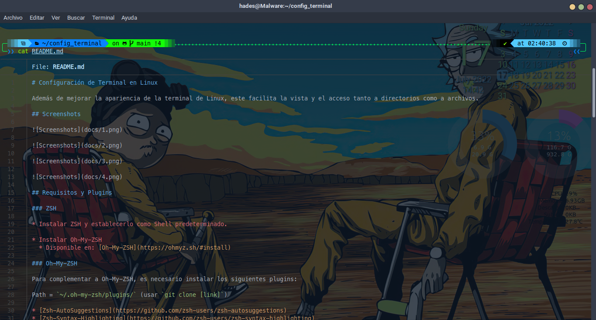

# Contenido

- [Terminal de Linux Personalizable by SirHades696](#terminal-de-linux-personalizable-by-sirhades696)
  * [Instalación Automática (Debian/Ubuntu) - Gnome-Terminal](#instalaci-n-autom-tica--debian-ubuntu----gnome-terminal)
  * [Screenshots](#screenshots)
  * [Requisitos y Plugins](#requisitos-y-plugins)
    + [ZSH](#zsh)
    + [Oh-My-ZSH](#oh-my-zsh)
    + [Powerlevel10k](#powerlevel10k)
    + [Colorls](#colorls)
    + [BatCat o simplemente Bat](#batcat-o-simplemente-bat)
    + [LSDeluxe](#lsdeluxe)
    + [Paleta de Colores Terminal](#paleta-de-colores-terminal)

# Terminal de Linux Personalizable by SirHades696


All plugins: [Plugins](https://github.com/ohmyzsh/ohmyzsh/wiki/Plugins)

Personaliza la terminal de tu Linux, dale una vista fabulosa y fantástica.

Plugins:

* MesloLGS NerdFont (tipografía)
* Colorls
* LSD
* Zsh
* BatCat
* Oh-My-Zsh
* Powerlevel10k

## Instalación Automática (Debian/Ubuntu) - Gnome-Terminal

>Nota: Si tienes un perfil de colores personalizado, por favor, realiza una copia de seguridad ya que al ejecutar el script se va a sobrescribir tu configuración.

>Puedes ejecutar los siguientes comandos:

>Carpeta de respaldo

`$ mkdir ~/mi_perfil_terminal/`

>Para guardar la configuración (colores, etc.)

`$ dconf dump /org/gnome/terminal/legacy/profiles:/ > ~/mi_perfil_terminal/gnome-terminal-profiles.dconf`

>Para volver a cargar el perfil a gnome-terminal una vez concluida la instalación (No olvides agregar “MesloLGS NF Regular” como tipografía personaliza a la terminal).

`$ dconf load /org/gnome/terminal/legacy/profiles:/ < ~/mi_perfil_terminal/gnome-terminal-profiles.dconf`

¿Quieres ahorrarte la modificaciones manuales?

Ejecuta las siguientes instrucciones en tu terminal.

`$ wget https://github.com/SirHades696/conf_terminal/raw/main/install.sh`

`$ sudo chmod +x install.sh`

`$ ./install.sh`

## Screenshots




## Requisitos y Plugins

### ZSH

* Instalar ZSH y establecerlo como Shell predeterminado.

* Instalar Oh-My-ZSH
  * Disponible en: [Oh-My-ZSH](https://ohmyz.sh/#install)

### Oh-My-ZSH

Para complementar a Oh-My-ZSH, es necesario instalar los siguientes plugins:

Path = `~/.oh-my-zsh/plugins/` (usar `git clone [link]`)

* [Zsh-AutoSuggestions](https://github.com/zsh-users/zsh-autosuggestions)
* [Zsh-Syntax-Highlighting](https://github.com/zsh-users/zsh-syntax-highlighting)
* [Zsh-AutoComplete](https://github.com/marlonrichert/zsh-autocomplete)
* [Nerd-Fonts](https://github.com/ryanoasis/nerd-fonts)
* [Git-Flow-Completion](https://github.com/bobthecow/git-flow-completion)

Nota: Los plugins dependen de cada usuario, sin embargo, es recomendable usar los primeros 4. Git flow completion no es necesario.

Nota: Agregar los plugins en el archivo `~/.zshrc`

```Zsh
plugins=(
	git-flow
	git-flow-completion
	git
	history
	emoji
	encode64
	zsh-syntax-highlighting
	zsh-autosuggestions
	python
	zsh-autocomplete
	dirhistory
	jsontools
	colored-man-pages	
)
```

### Powerlevel10k

Powerlevel10k permite cambiar la aparencia de la terminal agregando iconos y barras de visualización, requiere tener instalado `Nerd Fonts` para ser visualizado correctamente.

Disponible en: [Powerlevel10k](https://github.com/romkatv/powerlevel10k)

Nota: Para cambiar los colores de Powerlevel10k se modifica el archivo `.p10k.zsh` y se tomó como referencia la siguiente estructura:

[Source](https://medium.com/@christyjacob4/powerlevel9k-themes-f400759638c2)


Nota: Para el uso de colores se tomó como referencia la siguiente imagen:

[Source](https://github.com/Powerlevel9k/powerlevel9k/wiki/Stylizing-Your-Prompt#segment-color-customization)


### Colorls

Este plugin permite agregar iconos y colores para visualizar los folders y archivos.
Se requiere `ruby` para instalar este plugin.

* Disponible en: [ColorLS](https://github.com/athityakumar/colorls)

Nota: Agregar la siguiente configuración en `~/.zshrc` para reemplazar `ls command` por solo `ll, lla, ls y otros` con `colorls`

```Zsh
alias grep='grep --color=auto'
alias fgrep='fgrep --color=auto'
alias egrep='egrep --color=auto'
alias diff='diff --color=auto'

alias ls='ls --color=auto'
alias ll='ls -l'
alias lla='ls -la'
alias la='ls -A'
```


Ver [`.zshrc`](./.zshrc)

### BatCat o simplemente Bat

Permite mejorar la visualización de archivos con base al comando `cat [file]`

* Disponible en: [Bat](https://github.com/sharkdp/bat)

Nota: Agregar la siguiente configuración en `~/.zshrc` para reemplazar `BatCat` por solo `cat`

Ver [`.zshrc`](./.zshrc)

```Zsh
command -v batcat > /dev/null && \
	alias batcat='batcat --theme=TwoDark' && \
	alias cat='batcat --pager=never' && \
	alias less='batcat'
```

### LSDeluxe

LSD también agrega iconos y colores para todos los archivos y folders.

* Disponible en: [LSDeluxe](https://github.com/Peltoche/lsd)

Nota: Agregar la siguiente configuración en `~/.zshrc` para usar `lsd con colorls`

```Zsh
command -v lsd > /dev/null && alias ls='lsd --group-dirs first' && \
	alias tree='lsd --tree --gs --report'
command -v colorls > /dev/null && alias ls='colorls --sd --gs' && \
	alias tree='colorls --tree --gs --report'
```

Ver [`.zshrc`](./.zshrc)

Nota: La personalización de colores se realizó con base en la documentación y se modificó el archivo `dark_colors.yaml`

```yaml 
# Main Colors
unrecognized_file: purple
recognized_file:   cyan
executable_file:   lime
dir:               dodgerblue
```

Ver [`dark_colors.yaml`](./dark_colors.yaml)

### Paleta de Colores Terminal

||											| Texto				|Fondo			|
|---|---------------------|-------------|-----------|
||Color Predeterminado | `#B4E1FD`| `#0D1926`|
|off|Color de Negrita (bold)| `#B4E1FD`|
|on|Color de Cursor			| `#00283E`| `#00A3FF`|
|off|Color de Resaltado		| `#FFFFFF`| `#000000`|

|A  			|B				|C			  |D				|E			  |F			  |G			  |H			  |
|---------|---------|---------|---------|---------|---------|---------|---------|
| `#000000`| `#FF0071`| `#83FF08`| `#14FF08`| `#0883FF`| `#8308FF`| `#08FF83`| `#54CAFD`|
| `#006488`| `#FF0071`| `#8EFF1E`| `#14FF08`| `#1E8EFF`| `#8E1EFF`| `#1EFF8E`| `#C2C2C2`|
